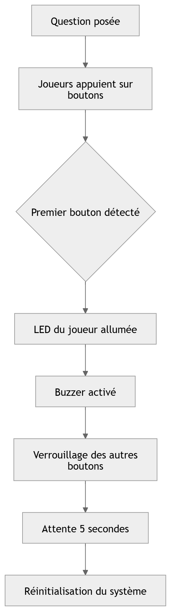

### SmartQuiz – Arduino Quiz Buzzer System

### Description

SmartQuiz est un système électronique interactif conçu pour organiser des jeux de quiz entre deux équipes.

Le système permet de :

détecter le premier joueur qui appuie sur son bouton

allumer la LED correspondante

déclencher un buzzer

bloquer les autres joueurs pendant quelques secondes

Ce système garantit une réactivité en temps réel et une équité entre les joueurs.

Le projet est basé sur la carte Arduino Uno et a été développé dans le cadre d’un projet pédagogique en systèmes embarqués.

## 🎥 Live Demonstration

This project was used during the educational quiz program **La Balade des Génies**.

Watch the show on YouTube:

https://www.youtube.com/@LaBaladedesGenies

### Objectifs du projet

Détection rapide du premier joueur

Gestion des entrées en temps réel

Feedback visuel (LED)

Feedback sonore (buzzer)

Verrouillage temporaire des boutons

Réinitialisation automatique

### Matériel nécessaire

1 × Arduino Uno

8 × boutons poussoirs

8 × LEDs

8 × résistances (220Ω ou 330Ω)

1 × buzzer

1 × breadboard

câbles jumper

### Logiciels nécessaires

Installer :

Arduino IDE

Téléchargement :

https://www.arduino.cc/en/software

### Installation
1️⃣ Cloner le projet
git clone https://github.com/ton-username/smartquiz-arduino.git

2️⃣ Ouvrir le code

Ouvrir le fichier dans Arduino IDE

Balade_des_genies.ino
3️⃣ Connecter la carte

Brancher la carte Arduino Uno

Puis dans l’IDE :

Tools → Board → Arduino Uno
Tools → Port → COMX
4️⃣ Téléverser le programme

Cliquer sur Upload.

📷 Schéma du circuit

Ajoute une image dans ton projet :

declaration.png

Puis dans README :

Exemple de connexion :

Composant	Arduino
Bouton 1	Pin 2
Bouton 2	Pin 3
Bouton 3	Pin 4
Bouton 4	Pin 5
Bouton 5	Pin 6
Bouton 6	Pin 7
Bouton 7	Pin 8
Bouton 8	Pin 9
Buzzer	Pin 10

### Diagramme du système

Ajoute une image dans ton projet :

diagram.png

Puis dans README :

# 📄 Documentation

Le rapport complet du projet est disponible ici :

📄 [Télécharger le rapport SmartQuiz](rapport.pdf)

### Équipe

Souleymane Touré — Directeur de projet

Mouhamadou Mokhtar Thiam — Chef de projet / IoT & systèmes embarqués

Djenaba Olivia Diallo — Développeuse embarquée

Mamadou Diagne Tine — Responsable câblage

### Auteur

Mouhamadou Mokhtar Thiam

### Si vous aimez ce projet, n’hésitez pas à laisser une étoile sur GitHub.
